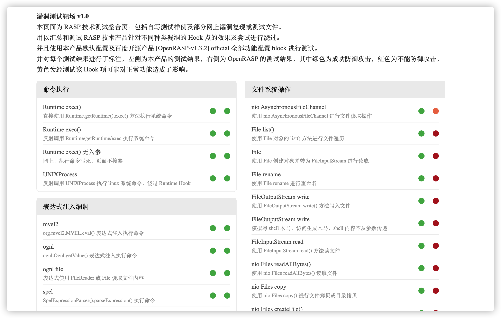
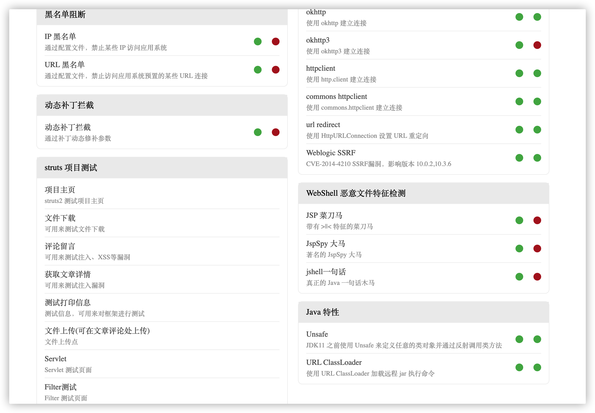

# rasp-vuln
当死去的记忆突然开始攻击我，我终于想起了我还写过一款十分十分垃圾的 rasp 靶场。

## 前言

在几年前，我就职于安百科技，参与了 Java RASP 的研究和开发工作。

当时对 Java 安全、Java RASP、漏洞原理的理解还十分有限，对于 RASP 产品的理解还停留在 Hook 点的深入性、攻击场景的覆盖性层面。

当时基于这个理解，我做了这个靶场，写了一些测试用例，里面针对一些漏洞利用手段和场景进行了编写和测试，当时主要针对 Hook 点的纵深、场景的覆盖、调用链的切断、请求关联的切断等等层面进行了一些尝试，具体可以看看代码。

由于用户问的多，还将同当时的 OpenRASP 的测试结果一起放在 index.html 中，并且每个链接点一点就能触发攻击和 RASP 防护，方便演示。

后来发现，对于一款成熟的商业化 RASP 产品，请求的差异性、协议兼容性、性能的影响、框架的适配性都是巨大的挑战，相比来讲，再多的漏洞利用场景、再多的 Hook 点覆盖、再深入的利用方式，都只能排在后面。

后来随着我对 Web 框架、组件的不断深入学习和研究，我发现写的这个所谓的 “靶场” 其实就是小孩的玩具，过于理想，过于局限，过于“实验室”。

再后来，我开始接触 OA、很大的框架和组件，我发现之前研究出来的所谓场景、纵深的防御能力，在这些实际环境中的实际效果被大大削弱，有的攻击无法防御，有的攻击防御住了，但导致功能不好用了。

这些 OA 的代码虽说是屎山，但是确实能解决用户问题，而用户不关心安不安全，他关心这个按钮点了原来好用现在不好用了，是为什么。

所以，本靶场在现在来看，可以用 “垃圾” 二字来形容，但在当时来看，我对我实现的这个靶场还是很满意的，我认为对这些技术的研究，是当时相关技术进步较快的主要原因。

## 补充

在 1.0 后，这个靶场还持续更新了至少大半年的时间，完善了非常多的测试能力，印象中还加入了 G01 的 Agent 的测试，并随着 OpenRASP 的版本更新一直在测试，还给 OpenRASP 提过无法防御的 BUG，后来的靶场里应该至少有小 100 个 JSP 测试文件。

但是后来基于 JSP 的靶场慢慢被废弃，因为很多客户不理解 JSP 的本质是什么，认为 JSP 靶场的测试不通用，非要 Servlet、SpringBoot 的靶场才因为有效。

在此事中我也掌握了一个道理，不要对技术上什么也不懂但是却有决策权的人讲道理，因为他们不听道理。

## 展示

随便扔两张截图

再扔一张

## 使用

都是大黑客该怎么使用就不教了，还不是有手就行。

## 彩蛋

本靶场里有很多 JSP 是首页没有链接的，仔细看看也许有惊喜哦~

## 后续

为什么说死去的记忆突然开始攻击我呢？因为这个靶场的 index.html，是我当时的前女友给写的，当时想做一个清爽的首页，点一点就能测试防御能力，还能清晰的给客户看到防御能力的对比，但是我不会前端，就找了当时的前端前女友给写的，占用了不少人家下班的时间...

所以...还是扔上来留个念...

好在我现在的女朋友不会逛 Github，应该看不见，嘻嘻
